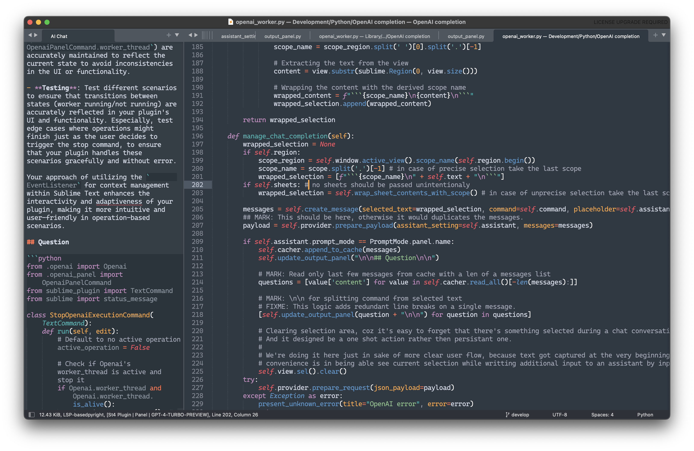

[![Star on GitHub][img-stars]][stars]

# OpenAI Sublime Text Plugin
## tldr;

OpenAI Completion is a Sublime Text plugin that uses LLM models to provide first class code assistant support within the editor.

It's not locked with just OpenAI anymore. [llama.cpp](https://github.com/ggerganov/llama.cpp) server and [ollama](https://ollama.com) supported as well.



## Features

- Code manipulation (append, insert and edit) selected code with OpenAI models.
- **Chat mode** powered by whatever model you'd like.
- **GPT-4 support**.
- **[llama.cpp](https://github.com/ggerganov/llama.cpp)**'s server, **[Ollama](https://ollama.com)** and all the rest OpenAI'ish API compatible.
- **Separated chats histories** and assistant settings for a projects.
- **Ability to send whole files** or their parts as a context expanding.
- Markdown syntax with code languages syntax highlight (Chat mode only).
- Server Side Streaming (SSE) (i.e. you don't have to wait for ages till GPT-4 print out something).
- Status bar various info: model name, mode, sent/received tokens.
- Proxy support.

### ChatGPT completion demo

https://github.com/yaroslavyaroslav/OpenAI-sublime-text/assets/16612247/37b98cc2-e9cd-46a6-ac5d-03845313096b

> video sped up to 1.7x

---

https://github.com/yaroslavyaroslav/OpenAI-sublime-text/assets/16612247/69f609f3-336d-48e8-a574-3cb7fda5822c

> video sped up to 1.7x

## Requirements

- Sublime Text 4
- **llama.cpp**, **ollama** installed _OR_
- Remote llm service provider API key, e.g. [OpenAI](https://platform.openai.com)

## Installation

1. Install the Sublime Text [Package Control](https://packagecontrol.io/installation) plugin if you haven't done this before.
2. Open the command palette and type `Package Control: Install Package`.
3. Type `OpenAI` and press `Enter`.

## Usage

### AI Assistance use case

ChatGPT mode works the following way:

0. Select some text or even the whole tabs to include them in request
1. Run either `OpenAI: Chat Model Select` or `OpenAI: Chat Model Select With Tabs` commands.
2. Input a request in input window if any.
3. The model will print a response in output panel by default, but you can switch that to a separate tab with `OpenAI: Open in Tab`.
4. To get an existing chat in a new window run `OpenAI: Refresh Chat`.
5. To reset history `OpenAI: Reset Chat History` command to rescue.

> [!NOTE]
>  You suggested to bind at least `OpenAI: New Message`, `OpenAI: Chat Model Select` and `OpenAI: Show output panel` in sake for convenience, you can do that in plugin settings.

### Chat history management

You can separate a chat history and assistant settings for a given project by appending the following snippet to its settings:

```json
{   
    "settings": {
        "ai_assistant": {
            "cache_prefix": "your_name_project"
        }
    }
}
```

### In buffer llm use case

1. You can pick one of the following modes: `append`, `replace`, `insert`. They're quite self-descriptive. They should be set up in assistant settings to take effect.
2. Select some text (they're useless otherwise) to manipulate with and hit `OpenAI: New Message`.
4. The plugin will response accordingly with **appending**, **replacing** or **inserting** some text.

> [!IMPORTANT]
>  Yet this is a standalone mode, i.e. an existing chat history won't be sent to a server on a run.

> [!NOTE]
> A more detailed manual, including various assistant configuration examples, can be found within the plugin settings.

### Other features

### Open Source models support (llama.cpp, ollama)

1. Replace `"url"` setting of a given model to point to whatever host you're server running on (e.g.`"http://localhost:8080"`). 
2. [Optional] Provide a `"token"` if your provider required one. 
3. Tweak `"chat_model"` to a model of your choice and you're set.

> [!NOTE]
> You can set both `url` and `token` either global or on per assistant instance basis, thus being capable to freely switching between closed source and open sourced models within a single session.

## Settings
The OpenAI Completion plugin has a settings file where you can set your OpenAI API key. This is required for the plugin to work. To set your API key, open the settings within `Preferences` -> `Package Settings` -> `OpenAI` -> `Settings` and paste your API key in the token property, as follows:

```JSON
{
    "token": "sk-your-token",
}
```

### [Multi]Markdown syntax with syntax highlight support

It just works.

> [!IMPORTANT]
> It's highly recommended to install the [`MultimarkdownEditing`](https://sublimetext-markdown.github.io/MarkdownEditing/) to apply broader set of languages with syntax highlighting.

### Proxy support

You can setup it up by overriding the proxy property in the `OpenAI completion` settings like follow:

```json
"proxy": {
    "address": "127.0.0.1", // required
    "port": 9898, // required
    "username": "account",
    "password": "sOmEpAsSwOrD"
}
```

## Disclaimers

> [!WARNING]
> All selected code will be sent to the OpenAI servers (if not using custom API provider) for processing, so make sure you have all necessary permissions to do so.

> [!NOTE]
> This one was initially written at 80% written by a GPT3.5 back then. I was here mostly for debugging purposes, rather than digging ST API. This is a pure magic, I swear!

[stars]: https://github.com/yaroslavyaroslav/OpenAI-sublime-text/stargazers
[img-stars]: static/media/star-on-github.svg
